## Hi there 👋

<!--
**dsp-unima/dsp-unima** is a ✨ _special_ ✨ repository because its `README.md` (this file) appears on your GitHub profile.

Here are some ideas to get you started:

- 🔭 I’m currently working on ...
- 🌱 I’m currently learning ...
- 👯 I’m looking to collaborate on ...
- 🤔 I’m looking for help with ...
- 💬 Ask me about ...
- 📫 How to reach me: ...
- 😄 Pronouns: ...
- ⚡ Fun fact: ...
-->

<picture>
  <source
    srcset="./profile/stats-dark.svg"
    media="(prefers-color-scheme: dark)"
  />
  <source
    srcset="./profile/stats-light.svg"
    media="(prefers-color-scheme: light), (prefers-color-scheme: no-preference)"
  />
  
</picture>

<picture>
  <source
    srcset="./profile/top-langs-dark.svg"
    media="(prefers-color-scheme: dark)"
  />
  <source
    srcset="./profile/top-langs-light.svg"
    media="(prefers-color-scheme: light), (prefers-color-scheme: no-preference)"
  />
  
</picture>

  

---

###

  
  
  

###

<h1 align="center">hey there 👋</h1>

###

<h3 align="left">👩‍💻  About Me</h3>

###

I'm ... from ....  - 🔭 I’m working as ... - 📚 I'm currently learning ... - ⚡ In my free time I ...

###

<h3 align="left">🛠 Language and tools</h3>

###

  
  
  
  
  
  
  
  
  
  
  
  
  
  
  
  
  
  
  
  
  
  
  
  
  
  
  
  
  
  
  
  
  
  
  
  
  
  
  
  
  
  
  
  
  
  
  
  
  
  
  
   
  
  
  
  
  
  
  
  
  Scikit-Learn
  
  Ray
  SPARQL
  OWL
  ruff
  setuptools
  Sphinx
  WandB
  Hydra
  OmegaConf
  SLURM
  SQLAlchemy
  HuggingFace

###

<h3 align="left">GitHub Stats :</h3>

###

  
  

###

  
  
  

###

  

###
