<!--
This is a ✨ _special_ ✨ repository because its `README.md` (this file) appears on your GitHub profile.

Here are some ideas to get you started:

- 🔭 I’m currently working on ...
- 🌱 I’m currently learning kubernets
- 👯 I’m looking to collaborate on ...
- 💬 Ask me about Machine & Deep learning, typing
- 📫 How to reach me: ...
- 🍀 Fun fact: Four-leaf clovers found: 20+, Five-leaf clovers found: 3

  

-->

###

<h1 align="center">Hey there 👋</h1>

###

<!--

<h3 align="left">👩‍💻  About Me</h3>

###

I'm ... from ....  - 🔭 I’m working as ... - 📚 I'm currently learning ... - ⚡ In my free time I ...

-->

###

<h3 align="left">GitHub Stats :</h3>

###

<picture>
  <source
    srcset="./profile/stats-dark.svg"
    media="(prefers-color-scheme: dark)"
  />
  <source
    srcset="./profile/stats-light.svg"
    media="(prefers-color-scheme: light), (prefers-color-scheme: no-preference)"
  />
  
</picture>
<picture>
  <source
    srcset="./profile/top-langs-dark.svg"
    media="(prefers-color-scheme: dark)"
  />
  <source
    srcset="./profile/top-langs-light.svg"
    media="(prefers-color-scheme: light), (prefers-color-scheme: no-preference)"
  />
  
</picture>

###

  

###

<h3 align="left">🛠 Language and tools</h3>

###

  
  
  
  
  
  
  
  
  
  
  
  
  
  
  
  
  
  
  
  
  
  
  
  
  
  
  
  
  
  
  
  
  
  
  
  
  
  
  
  
  
  
  
  
  
  
  
  
  
  
  
  
   

  
  
  
  
  
  
  
  
  
  
  
  
  
  
  
  
  
  
  
  
  
  
  
  
  
  
  
  
  
  

<h2 class="text-lg font-semibold">Top Contributions</h2>

<a target="_blank" href="https://github.com/search?q=owner%3Apython%20author%3ADaraan%20is%3Amerged&type=pullrequests&s=comments&o=desc">
  <picture>
  <source
    srcset="./profile/prs/dark-python-cpython.svg"
    media="(prefers-color-scheme: dark)"
  />
  <source
    srcset="./profile/prs/light-python-cpython.svg"
    media="(prefers-color-scheme: light), (prefers-color-scheme: no-preference)"
  />
  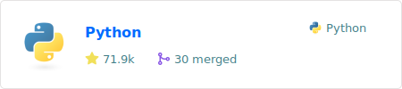
</picture></a>
<a target="_blank" href="https://github.com/search?q=owner%3Acarla-simulator%20author%3ADaraan%20is%3Amerged&type=pullrequests&s=comments&o=desc">
  <picture>
  <source
    srcset="./profile/prs/dark-carla-simulator-carla.svg"
    media="(prefers-color-scheme: dark)"
  />
  <source
    srcset="./profile/prs/light-carla-simulator-carla.svg"
    media="(prefers-color-scheme: light), (prefers-color-scheme: no-preference)"
  />
  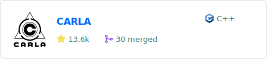
</picture></a>

<a target="_blank" href="https://github.com/search?q=owner%3Aray-project%20author%3ADaraan%20is%3Amerged&type=pullrequests&s=comments&o=desc">
  <picture>
  <source
    srcset="./profile/prs/dark-ray-project-ray.svg"
    media="(prefers-color-scheme: dark)"
  />
  <source
    srcset="./profile/prs/light-ray-project-ray.svg"
    media="(prefers-color-scheme: light), (prefers-color-scheme: no-preference)"
  />
  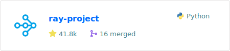
</picture></a>
<a target="_blank" href="https://github.com/search?q=owner%3Aswansonk14%20author%3ADaraan%20is%3Amerged&type=pullrequests&s=comments&o=desc">
  <picture>
  <source
    srcset="./profile/prs/dark-swansonk14-typed-argument-parser.svg"
    media="(prefers-color-scheme: dark)"
  />
  <source
    srcset="./profile/prs/light-swansonk14-typed-argument-parser.svg"
    media="(prefers-color-scheme: light), (prefers-color-scheme: no-preference)"
  />
  
</picture></a>

<a target="_blank" href="https://github.com/search?q=owner%3ALucasAlegre%20author%3ADaraan%20is%3Amerged&type=pullrequests&s=comments&o=desc">
  <picture>
  <source
    srcset="./profile/prs/dark-LucasAlegre-sumo-rl.svg"
    media="(prefers-color-scheme: dark)"
  />
  <source
    srcset="./profile/prs/light-LucasAlegre-sumo-rl.svg"
    media="(prefers-color-scheme: light), (prefers-color-scheme: no-preference)"
  />
  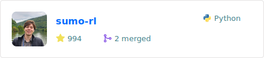
</picture></a>

<a target="_blank" href="https://github.com/search?q=owner%3ACORE-Robotics-Lab%20author%3ADaraan%20is%3Amerged&type=pullrequests&s=comments&o=desc">
  <picture>
  <source
    srcset="./profile/prs/profile/prs/dark-CORE-Robotics-Lab-Interpretable_DDTS_AISTATS2020.svg"
    media="(prefers-color-scheme: dark)"
  />
  <source
    srcset="./profile/prs/light-CORE-Robotics-Lab-Interpretable_DDTS_AISTATS2020.svg"
    media="(prefers-color-scheme: light), (prefers-color-scheme: no-preference)"
  />
  
</picture></a>

<a target="_blank" href="https://github.com/search?q=owner%3AFarama-Foundation%20author%3ADaraan%20is%3Amerged&type=pullrequests&s=comments&o=desc">
  <picture>
  <source
    srcset="./profile/prs/dark-Farama-Foundation-Gymnasium.svg"
    media="(prefers-color-scheme: dark)"
  />
  <source
    srcset="./profile/prs/light-Farama-Foundation-Gymnasium.svg"
    media="(prefers-color-scheme: light), (prefers-color-scheme: no-preference)"
  />
  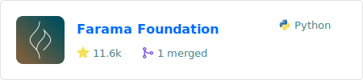
</picture></a>
<a target="_blank" href="https://github.com/search?q=owner%3Alanpa%20author%3ADaraan%20is%3Amerged&type=pullrequests&s=comments&o=desc">
  <picture>
  <source
    srcset="./profile/prs/dark-lanpa-tensorboardX.svg"
    media="(prefers-color-scheme: dark)"
  />
  <source
    srcset="./profile/prs/light-lanpa-tensorboardX.svg"
    media="(prefers-color-scheme: light), (prefers-color-scheme: no-preference)"
  />
  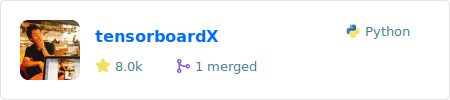
</picture></a>

<a target="_blank" href="https://github.com/search?q=owner%3Awandb%20author%3ADaraan%20is%3Amerged&type=pullrequests&s=comments&o=desc">
  <picture>
  <source
    srcset="./profile/prs/dark-wandb-wandb.svg"
    media="(prefers-color-scheme: dark)"
  />
  <source
    srcset="./profile/prs/light-wandb-wandb.svg"
    media="(prefers-color-scheme: light), (prefers-color-scheme: no-preference)"
  />
  
</picture></a>
<a target="_blank" href="https://github.com/search?q=owner%3Apydantic%20author%3ADaraan%20is%3Amerged&type=pullrequests&s=comments&o=desc">
  <picture>
  <source
    srcset="./profile/prs/dark-pydantic-pydantic.svg"
    media="(prefers-color-scheme: dark)"
  />
  <source
    srcset="./profile/prs/light-pydantic-pydantic.svg"
    media="(prefers-color-scheme: light), (prefers-color-scheme: no-preference)"
  />
  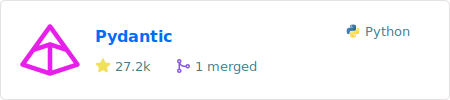
</picture></a>

---

<a target="_blank" href="https://github.com/Daraan/CropAndWeedDetection">
  <picture>
  <source
    srcset="./profile/prs/dark-own-Daraan-CropAndWeedDetection.svg"
    media="(prefers-color-scheme: dark)"
  />
  <source
    srcset="./profile/prs/light-own-Daraan-CropAndWeedDetection.svg"
    media="(prefers-color-scheme: light), (prefers-color-scheme: no-preference)"
  />
  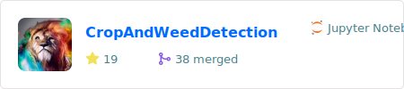
</picture></a>
<a target="_blank" href="https://github.com/Daraan/Dark-Squirrel-Scripts">
  <picture>
  <source
    srcset="./profile/prs/dark-own-Daraan-Dark-Squirrel-Scripts.svg"
    media="(prefers-color-scheme: dark)"
  />
  <source
    srcset="./profile/prs/light-own-Daraan-Dark-Squirrel-Scripts.svg"
    media="(prefers-color-scheme: light), (prefers-color-scheme: no-preference)"
  />
  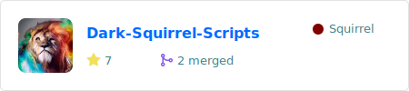
</picture></a>
<a target="_blank" href="https://github.com/Daraan/KnowledgeGraphTransformer">
  <picture>
  <source
    srcset="./profile/prs/dark-own-Daraan-KnowledgeGraphTransformer.svg"
    media="(prefers-color-scheme: dark)"
  />
  <source
    srcset="./profile/prs/light-own-Daraan-KnowledgeGraphTransformer.svg"
    media="(prefers-color-scheme: light), (prefers-color-scheme: no-preference)"
  />
  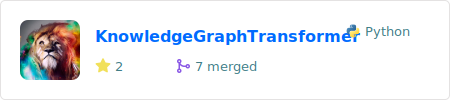
</picture></a>

<a target="_blank" href="https://github.com/Daraan/ray_utilities">
  <picture>
  <source
    srcset="./profile/prs/dark-own-Daraan-ray_utilities.svg"
    media="(prefers-color-scheme: dark)"
  />
  <source
    srcset="./profile/prs/light-own-Daraan-ray_utilities.svg"
    media="(prefers-color-scheme: light), (prefers-color-scheme: no-preference)"
  />
  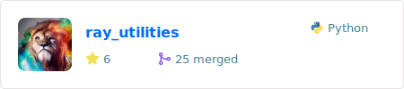
</picture></a>
